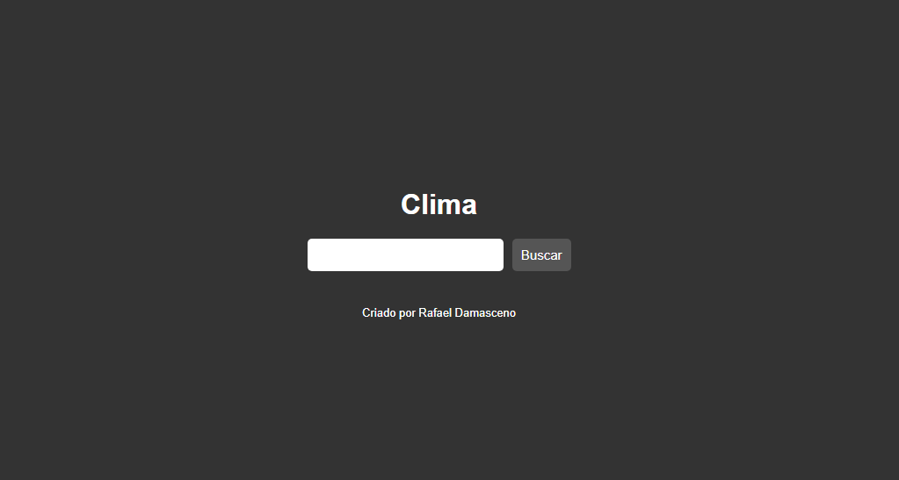

# Clima
> site teste de requisições e manipulação de API

Projeto construído como exercício do curso da B7web
> propício a mudanças 

[Clique aqui para acessar]()

## Tecnologias:

- HTML
- CSS
- Git e Github
- javaScript

### Aprendido:

- Manipulação de API
- Requisição interna
